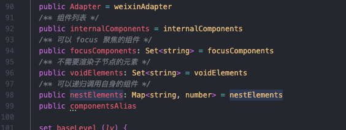
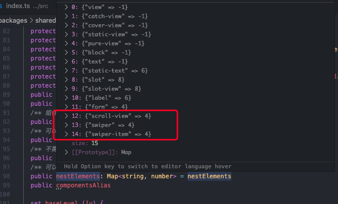
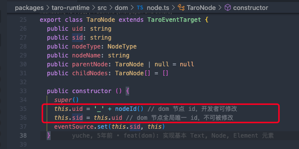
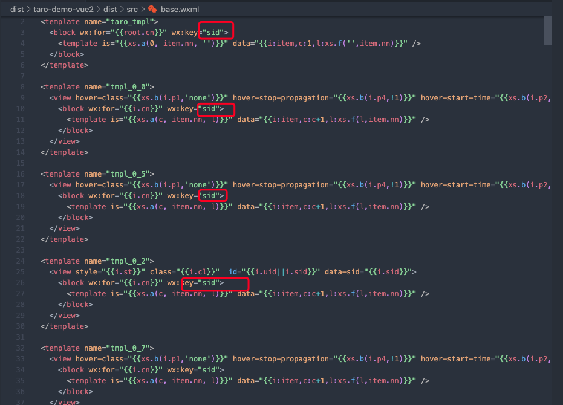

## Taro.options.debug

可以在业务代码中，通过设置 Taro.options.debug，来开启调试模式。在调试模式下，可以查看有关运行时的页面渲染（packages/taro-runtime/src/dom/root.ts）相关的setData。

例如在业务的app.js中，

```
import Vue from 'vue'
import './app.scss'
import Taro from '@tarojs/taro'
Taro.options.debug = true; //开启debug
const App = {
  onShow (options) {
    console.log('App onShow.')
  },
  render(h) {
    // this.$slots.default 是将要会渲染的页面
    return h('block', this.$slots.default)
  }
}

export default App
```

## 运行时 页面渲染

运行时，页面的渲染，主要是通过模板+data的形式，其中模板生成是编译阶段分析生成base.wxml

data的设置逻辑在 packages/taro-runtime/src/dom/root.ts。 业务代码是 vue，改写运行时的dom的api，通过执行vue渲染函数调用这些api，生成渲染信息

/packages/taro-runtime/src/dom/element.ts 中：

```
export class TaroElement extends TaroNode {}
```

setAttribute 会在 xxx 阶段执行，执行会导致调用 this.enqueueUpdate,会调用 this._root?.enqueueUpdate(payload) 将 payload 添加到 root.updatePayloads。

在后续 performUpdate 阶段，会根据payload内容生成 data.root 。 data.root 结合 base.wxml 实现页面渲染。

payload产生的核心逻辑在 /packages/taro-runtime/src/dom/element.ts 中 setAttribute

其中 root.cn 是通过 value() 生成的

## utils.wxs

由 packages/shared/src/template.ts 生成。

base.wxml中选择模板template 是依赖 wxs 中 xs.a 函数实现

## componentsAlias

编译时和运行时如何对齐组件，通过componentsAlias的map实现

## 组件嵌套

默认的组件嵌套深度 16 层。生成的base.wxml中，view、text都会生成16层

其中有部分组件层数会少于16层，例如swiper、scroll-view只有4层，该部分逻辑控制在：

packages/shared/src/template.ts





## root 字段含义

- cl: class
- cn: 节点
- sid：模板渲染时，遍历渲染的key
- value





