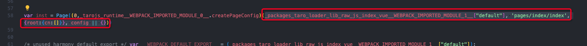
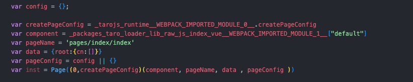
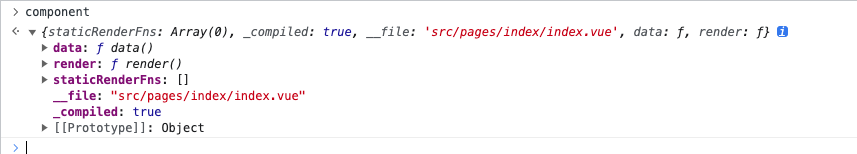
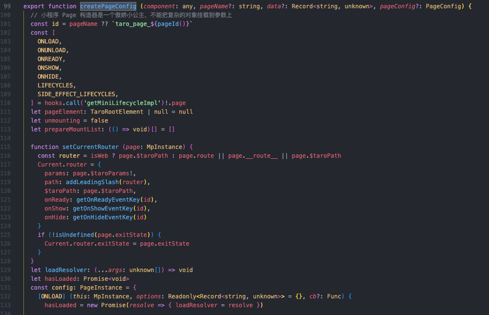
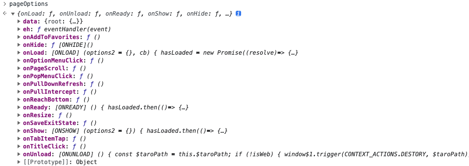
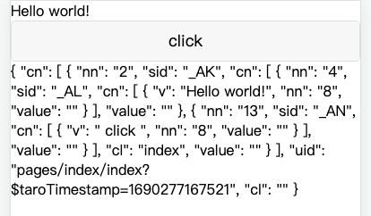

# 页面page对应运行时

**以page/index/index 为例，运行时的 js：**

```javascript
var inst = Page((0,_tarojs_runtime__WEBPACK_IMPORTED_MODULE_0__.createPageConfig)(_packages_taro_loader_lib_raw_js_index_vue__WEBPACK_IMPORTED_MODULE_1__["default"], 'pages/index/index', {root:{cn:[]}}, config || {}))
```



我们简化一下：



**其中**

* `_tarojs_runtime__WEBPACK_IMPORTED_MODULE_0__.createPageConfig` 即 taro/runtime 中  `createPageConfig`

**接受参数：**

* **component:** `_packages_taro_loader_lib_raw_js_index_vue__WEBPACK_IMPORTED_MODULE_1__['default']`



* **pageName：`'pages/index/index'`**
* **data：** `{root:{cn:[]}}`
* **pageConfig:	**`{}`

`createPageConfig` 方法定义在 packages/taro-runtime/src/dsl/common.ts



**通过createPageConfig生成config，最终调用 Page 构造器生成页面**：



**页面代码如下：**

```vue
<template>
  <view class="index">
    <text>{{ msg }}</text>
    <button @tap="clickHandler"> click </button>
  </view>
</template>

<script>
import './index.scss'

export default {
  data () {
    return {
      msg: 'Hello world!'
    }
  },
  methods:{
    clickHandler(){
      this.msg += '!'
    }
  }
}
</script>
```

**修改生成的 index.wxml**


**可以看到：**



**即渲染的核心就是通过root定义内容结合模板进行渲染**

**那么问题是** : root是如何生成的？？？？？？

**目前初步看是 packages/taro-runtime/src/dom/root.ts 进行root设置的 ；（开发模式下可以将 packages/taro-runtime/src/options.ts 中 debug 开启，查看设置的root值）**


`normalUpdate`：


**data['root.cn[0]'] 是调用 ['root.cn.[0]', 'root.cn[0]'] 对应的函数生成的。**


* **data：**


* **resetPaths：**


* **【112-115】将 root.cn.[0] 转换成对应的 fn 执行的结果**

# ['root.cn.[0]', 'root.cn[0]'] 对应的函数挂载：

**packages/taro-runtime/src/dom/node.ts**


**packages/taro-mini-runner/src/webpack/build.conf.ts**


**可以看到这里有使用 plugin.provierPlugin 定义了 document、window、Element。**

**造成的结果，当基于 vue 实现 vnode => dom的过程中调用 document.createElement 之类的api时，实际执行的是 taro中定义的运行时的document的api。**


# wx["webpackJsonp"]

**wx["webpackJsonp"] 是 taro 挂载在 wx 上的新增属性。**


**可以看到 webpackJsonp 是一个二维数组。数组每一个项都是一个数组。以 app.js 为例：**

**第一个参数： 数组 ['app']**

**第二个参数：对象 **

**第三个参数：数组 [["./src/app.ts","runtime","vendors","common"]]**
